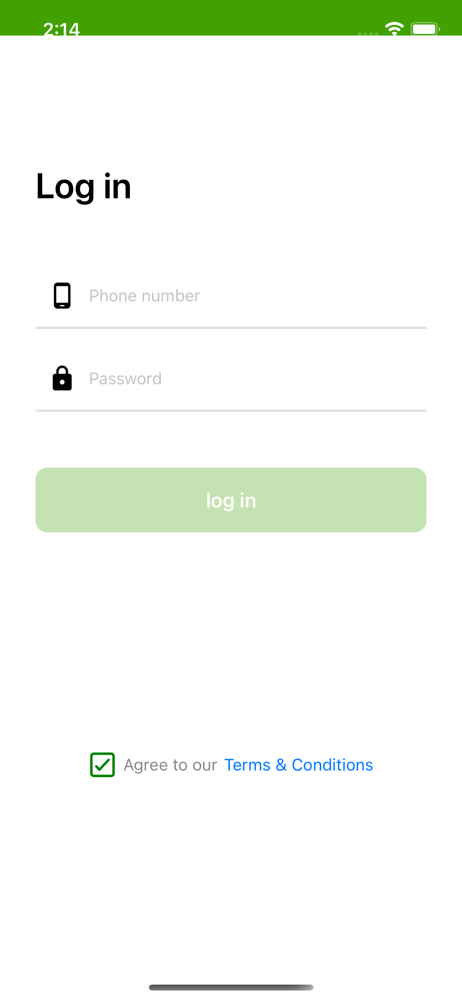

# OneKyatDemo

> OneKyatDemo is E-commerce application develop with Native iOS Swift. Using VIPER architecture. Not Include API calls only static data stored by JSON type. Login, Dashboard and Detail Pages are included. No third party Library.

## Project Breakdown
- UICollectionView for showing Items
  - nested UICollectionView for ad banners
- Scroll View
- Stack View

## Screenshots

  
  
  

